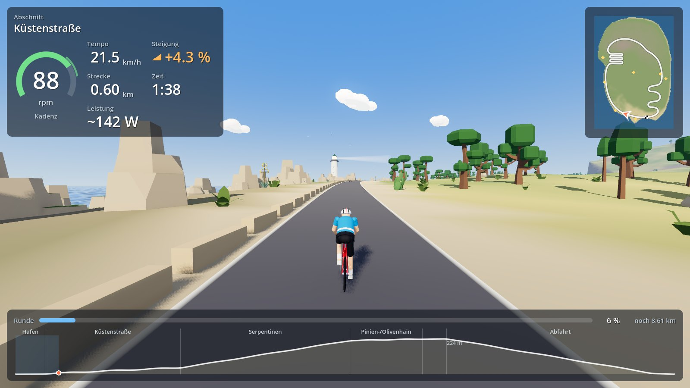
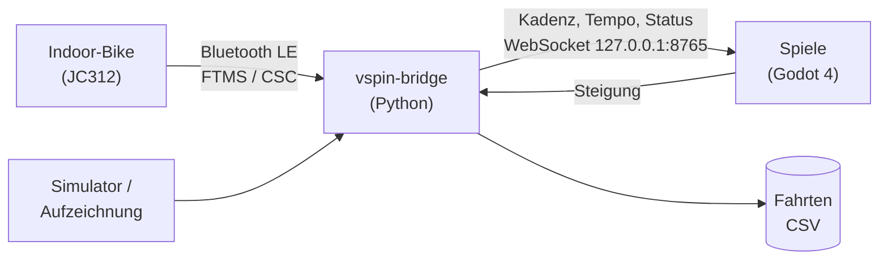

<p align="center">
  
</p>

<h1 align="center">VSpin</h1>

<p align="center">
  Eigene Spiele für das Indoor-Bike.<br>
  VSpin liest die Kadenz eines Spinning-Rads per Bluetooth und macht daraus die Steuerung für Spiele.
</p>



## Was VSpin macht

Spinning-Räder wie das **Wenoker JC312** senden ihre Messwerte per Bluetooth Low Energy, gedacht für Apps wie
Zwift oder Kinomap. VSpin nimmt diese Werte selbst ab und stellt sie eigenen Spielen zur Verfügung:

- **Rad verbinden:** Die Bridge spricht die Bluetooth-Standards für Fitnessgeräte (FTMS) und für Trittfrequenz
  (CSC). Sie glättet die Kadenz, verwirft Ausreißer und meldet, ob das Rad verbunden ist.
- **Ohne Rad entwickeln:** Ein Simulator (Tastatur oder Trainingsprofil) und das Abspielen aufgezeichneter Fahrten
  liefern dieselben Daten wie das echte Rad.
- **Spiele anschließen:** Alle Werte laufen über einen lokalen WebSocket. Beliebig viele Spiele und Werkzeuge können
  gleichzeitig mitlesen; nur die Bridge spricht Bluetooth.
- **Fahrten aufzeichnen:** Jede Fahrt wird als CSV gespeichert, dazu die Rohdaten des Rads.
- **Steigung zurückmelden:** Spiele melden die virtuelle Steigung an die Bridge. Das ist der Andockpunkt für eine
  spätere elektronische Widerstandssteuerung.

## So hängt es zusammen



## Inselfahrt

Das erste Spiel ist ein 3D-Radsimulator im Low-Poly-Stil. Man tritt, das Rad fährt; gelenkt wird nicht.

- Ein Rundkurs von 9,2 km über eine Insel im Mallorca-Stil: Hafen, Küstenstraße, Serpentinen mit Aussichtspunkt,
  Pinien- und Olivenhain, Bergdorf und Abfahrt.
- Bergauf wird man bei gleicher Kadenz langsamer, bergab schneller.
- Sehenswürdigkeiten am Weg: Leuchtturm, Wachturm, Einsiedelei, Burgruine, Aquädukt und Windmühlen.
- Tag und Nacht folgen der echten Uhrzeit auf Mallorca; dazu simuliertes Wetter bis hin zu Regen.
- HUD mit Kadenz, Tempo, Steigung, Minikarte und Höhenprofil; Grafikmenü, Fenstermodus und eine Bildschirmhälfte
  für das Spiel, damit daneben Platz für Musik bleibt.
- Läuft auch im Browser, per Docker ohne lokale Installation.

## Ausprobieren

Ohne Rad, nur mit [Docker Desktop](https://www.docker.com/products/docker-desktop/):

```powershell
docker compose up --build -d
```

Dann http://localhost:8080 öffnen. Der Simulator tritt mit 80 rpm. Installation, Start mit dem echten Rad, Tests und
alle Optionen stehen in der **[Anleitung](docs/anleitung.md)**.

## Stand

VSpin ist in Arbeit (v1). Bridge, Simulator, Aufzeichnung und die Inselfahrt laufen ohne Rad. Es fehlt noch die
Verbindung zum echten JC312 unter Windows; dafür braucht es zuerst einen Mitschnitt seines Bluetooth-Protokolls.

## Im Repository

| Ordner | Inhalt |
|---|---|
| [`bridge/`](bridge/) | Bridge in Python: Bluetooth-, Simulator- und Replay-Quellen, Parser, Bus, Aufzeichnung |
| [`games/island-ride/`](games/island-ride/) | Spiel „Inselfahrt“ (Godot 4) |
| [`tools/`](tools/) | Hilfsskripte, z. B. Bluetooth-Mitschnitt des Rads |
| [`docs/`](docs/) | [Anleitung](docs/anleitung.md), [Bus-Protokoll](docs/bus-protocol.md), [Architekturentscheidungen](docs/adr/), [Marke](docs/brand/) |
| [`CONTEXT.md`](CONTEXT.md) | Glossar |

## Lizenz

MIT, siehe [LICENSE](LICENSE). Modelle in der Inselfahrt von [Kenney](https://kenney.nl) (CC0), Nachweis in
[`ASSETS.md`](games/island-ride/ASSETS.md). [qdomyos-zwift](https://github.com/cagnulein/qdomyos-zwift) (GPL-3.0)
dient nur als Lesereferenz.
